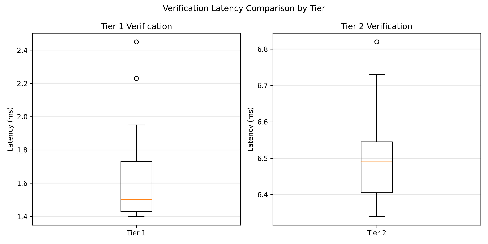
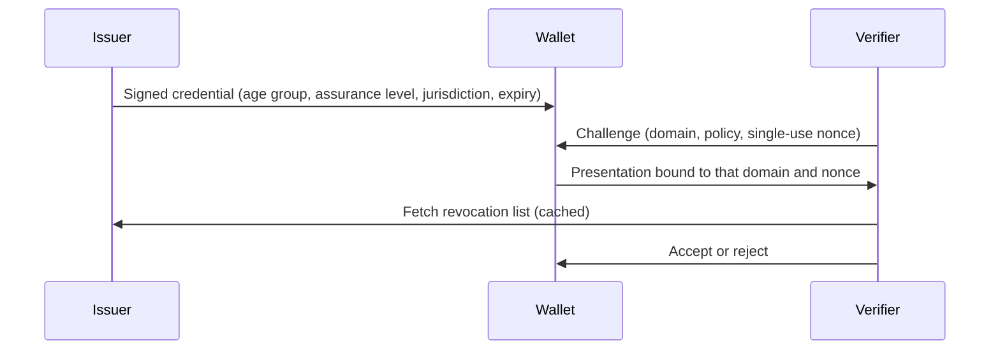

# Selective-Disclosure Identity Prototype

Prove a fact about yourself to a website, such as "I'm over 18", without revealing who you are and without letting websites link you across domains.

This repo implements that idea twice, once with ordinary signatures and once with BBS+ zero-knowledge proofs, and measures what the extra privacy costs.

## Result

In this prototype, BBS+ selective disclosure verified in **6.5 ms** against **1.5 ms** for the baseline, and took about **46 ms** end to end including proof generation. That is under half the 100 ms feasibility target set before the experiments, at the same presentation size.

| | Tier 1: Ed25519 baseline | Tier 2: BBS+ selective disclosure |
| --- | --- | --- |
| Verification time (median) | 1.5 ms | 6.5 ms |
| Proof generation time (median) | n/a | 39 ms |
| Total time (median) | 1.5 ms | 46 ms |
| Presentation size | 1,184 bytes | 1,177 bytes |
| Replayed presentation | Rejected | Rejected |
| Revoked credential | Rejected | Rejected |
| Verifier sees the full credential | Yes | No, only the revealed claims |

Medians are over 20 valid presentations per tier with the first run dropped as warm-up, on one laptop over localhost. Raw data is in [`experiments/results/`](experiments/results/).



Proof generation is timed around a fresh Node process for each proof, so the 39 ms figure includes process startup and is an upper bound on the cryptographic cost.

## How it works

There are three actors:

| Actor | Role | Implementation |
| --- | --- | --- |
| Issuer | Signs credentials, publishes a signed revocation list | Python, Flask |
| Wallet | Holds the credential, builds presentations | Python |
| Verifier | Issues challenges, checks presentations against a policy | Node.js, Express |



The two tiers share this flow and differ in what the wallet sends:

- **Tier 1** attaches the whole credential with the issuer's Ed25519 signature, plus a wallet signature over a digest of the domain, policy and nonce. It is simple and fast, but the verifier sees every claim.
- **Tier 2** signs the claims as a BBS+ message vector over BLS12-381. The wallet sends a zero-knowledge proof that reveals only the claims the policy needs and hides the rest.

Both tiers use single-use, time-limited nonces against replay, a per-domain pseudonym derived by HMAC from a wallet secret, and a revocation list that the verifier refreshes every 10 seconds.

The BBS+ primitives come from MATTR's [`node-bbs-signatures`](https://github.com/mattrglobal/node-bbs-signatures). The protocol, both tiers, the three services and the experiment harness are written for this project.

More detail: [architecture](docs/architecture.md), [protocol](docs/protocol.md), [threat model](docs/threat-model.md), [evaluation matrix](docs/evaluation-matrix.md).

## Experiments

Each tier runs the same scenarios against live issuer and verifier services:

| Scenario | Expected | Tier 1 | Tier 2 |
| --- | --- | --- | --- |
| Valid presentation, 20 runs | Accepted | 20 of 20 | 20 of 20 |
| Same presentation replayed | Rejected | `NONCE_INVALID` | `NONCE_INVALID` |
| Presentation to a second domain | Accepted, under a different pseudonym | Accepted | Accepted |
| Credential revoked, then presented | Rejected | `REVOKED` | `REVOKED` |

## Limitations

This is a research prototype, and these gaps are known:

- **Revocation breaks unlinkability.** The Tier 2 presentation reveals a static revocation handle, so colluding verifiers could link a user across sites despite the per-domain pseudonym. A real design would need anonymous revocation, for example a cryptographic accumulator.
- **Credential expiry is not enforced.** The verifier reads the expiry claim and does not reject expired credentials.
- **Small sample, one machine.** 20 runs per tier over localhost, with no network latency and no concurrent load.
- **Proof timing includes process startup**, as noted above.
- **Local only.** Keys are stored in plain files, there is no transport security, and nothing here has been audited. Do not use it for real identity data.

## Running it

Requires Python 3.12 and Node.js 22.

```bash
git clone https://github.com/AnhadPahwa/selective-disclosure-identity.git
cd selective-disclosure-identity
python3 -m venv .venv && source .venv/bin/activate
pip install -r requirements.txt
npm install
```

Start the two services in separate terminals, from the repo root:

```bash
python3 -m issuer.issuer_service      # issuer on 127.0.0.1:5001
node verifier/verifier_service.js     # verifier on 127.0.0.1:5002
```

Tier 1:

```bash
python3 -m wallet.issue_credential
python3 -m experiments.run_tier1_tests
```

Tier 2:

```bash
node verifier/bbs_tool.js keygen
node verifier/bbs_tool.js sign examples/cred_for_bbs.json > wallet_data/credential_bundle_v2.json
python3 -m experiments.run_tier2_tests
```

Both scripts write a CSV to `experiments/results/` and overwrite the committed one. To regenerate the plots:

```bash
python3 experiments/results/analysis.py
```

## Repository layout

```
crypto/        Ed25519 signing, hashing, canonical JSON, encoding
issuer/        Credential issuance, revocation list, issuer service
wallet/        Key generation, storage, pseudonyms, presentations for both tiers
verifier/      Verifier service, revocation cache, BBS+ sign/prove/verify tool
experiments/   Test harnesses, raw results, analysis and plots
tests/         One-off checks used during development
examples/      Sample protocol messages
docs/          Architecture, protocol, threat model, evaluation matrix
```

## Context

Built in 2026 as an AP Research project on whether cryptographic identity tokens can balance child safety, fraud prevention and user anonymity.